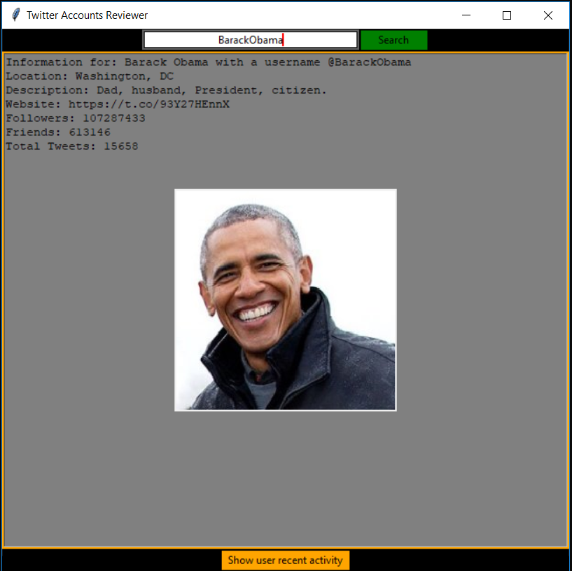

# Preview:

___________________________________________________________________________________________________________________ 

### Installation
- Download [main.exe](./main.exe)

### Description
- A simple application for reviweing public Twitter profiles
- [Twitter API](https://python-twitter.readthedocs.io/en/latest/installation.html) and [Tkinter GUI](https://wiki.python.org/moin/TkInter) are used to access and display data in a user-friendly way.
- Application is built with Python 3.7

Note: It will take some time for the Command Prompt to run the exe file.
